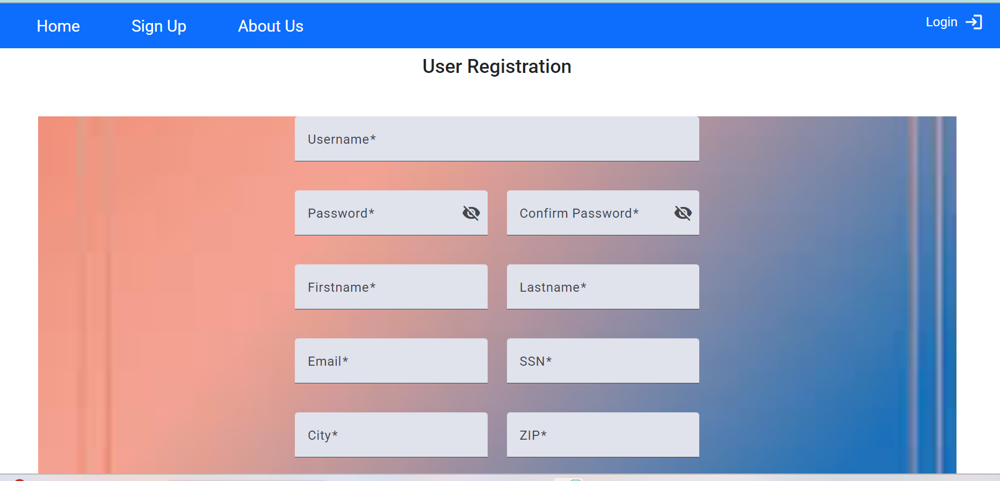
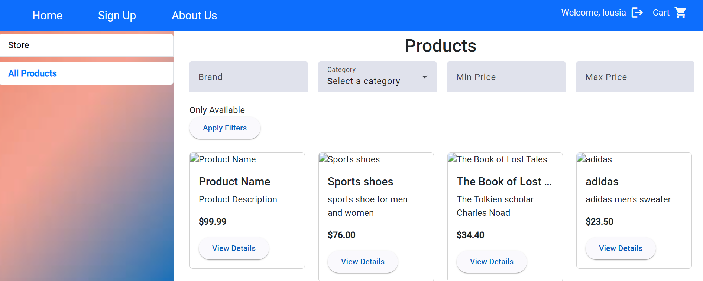
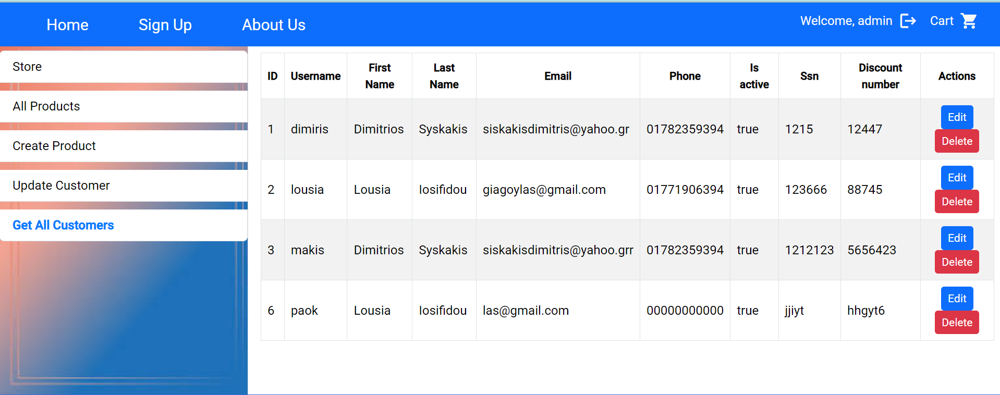
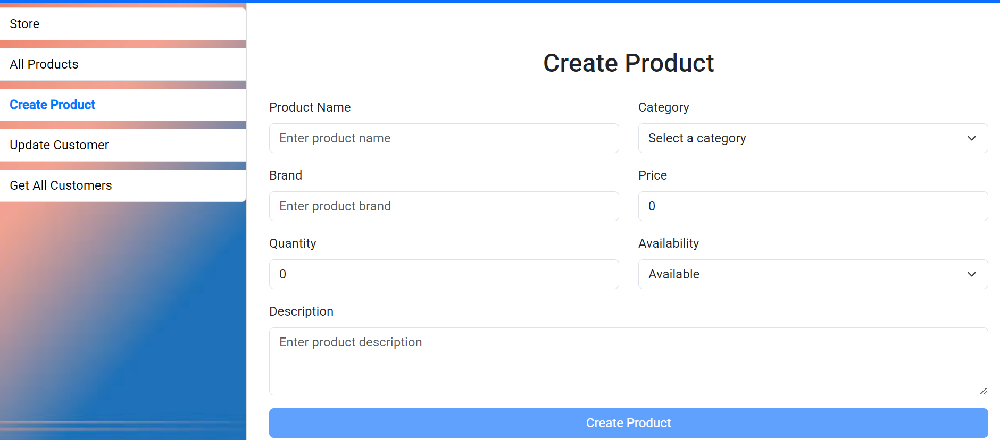

# E-commerce Platform (Full Stack)

## Overview
This project is a full-stack e-commerce platform built with a Spring Boot backend and an Angular frontend.

It includes authentication, role-based access control, product management, and shopping cart functionality.

The system demonstrates how frontend and backend communicate through REST APIs in a real-world application structure.

---

## Tech Stack

### Backend
- Java
- Spring Boot
- Spring Security
- JWT Authentication
- MySQL
- Gradle

### Frontend
- Angular
- TypeScript
- HTML / CSS
- REST API integration

---

## Architecture

- Backend → REST API, authentication, business logic, database
- Frontend → UI, routing, forms, API communication

The application follows a layered architecture and clean separation of concerns.

---

## Repositories

### Backend
https://github.com/dimisysk/e-commerce

### Frontend
https://github.com/dimisysk/factory-project

---

## Features

- JWT authentication
- Role-based authorization (Admin / User)
- Product browsing and filtering
- Shopping cart functionality
- Customer and product management (CRUD)
- REST API communication
- Structured Angular frontend

---

## Screenshots

### Home


---

### Login


---

### Register


---

### Products


---

### Cart


---

### Admin Panel (Customers)


---

### Update Customer


---

### Create Product


---

## How to Run

### Backend
```bash
./gradlew bootRun
```

### For Windows:
```bash
gradlew.bat bootRun
```

### Frontend
```bash
npm install
ng serve
```

### Local URLs
- Frontend: http://localhost:4200
- Backend: http://localhost:8080

## Notes

This project is built for demonstration and learning purposes.

---

## Future Improvements

- Improve UI/UX consistency
- Add validation and error handling
- Add testing (unit & integration)
- Improve production readiness

  
